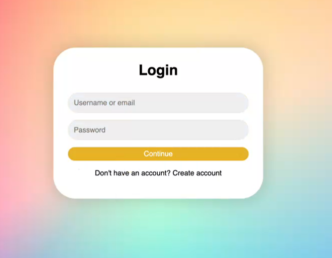
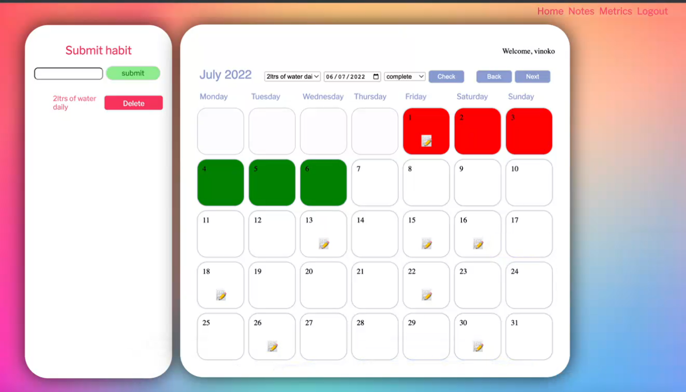

# Welcome to Dojo!

Dojo is the name of our habit tracker, where users can sign up and register an account with us! Users can then login into their account and start tracking their habits. Want to track how many laps you have done this week for swimming? You can! Or do you want to track you running habits in the month of July? You can now with Dojo! You can also track you habits in a pie chart to see how well you are doing!

## Table of Contents

- [Installation & Usage](#installation--usage)
  - [Installation](#installation)
  - [Local Usage](#usage)
  - [Deployment](#deployment)
- [See the Sites](#see-the-sites)
- [Technologies](#technologies)
- [Changelog](#changelog)
- [Wins & Challenges](#wins--challenges)
  - [Wins](#wins)
  - [Challenges](#challenges)
- [Bugs](#bugs)
- [Goals for the Future!](#goals-for-the-future)

## Installation & Usage

### Installation

- Clone or download the repo
- Navigate to the dojo_habit_tracker_server folder at the command line
- Run `npm install` to install dependencies

### Local Usage

- Enable docker to run on your computer
- Navigate through the scripts folder, starting with `teardown.sh` then `startDev.sh`
- Navigate through the commands for each script file and run the server locally

### Deployment

- View the client live on [Netlify]( --- )

#### Testing

- While in the api folder, `git branch` to `test`, run `npm test` to launch the test suite

## See the Sites

#### Sign up to Dojo...

#### ...and start tracking your own habits!

## Technologies used

#### Planning & Design Tools

- Trello Board ([View our template here](https://trello.com/b/v35jlBM4/project-week-habit-tracker))
- Figma ([View our template here](https://www.figma.com/file/1zubB81V9oggi1EQZH7OYE/Dojo?node-id=1%3A4))

#### HTML/CSS/JS Tools

- Watchify

## Changelog

#### JavaScript

- Controllers
    - auth.js
    - habits.js
    - users.js
- Models
    - habits.js
    - user.js
- Routes
    - habits.js
    - users.js

## Wins & Challenges

### Wins

- Fully responsive app
- Calendar view enables users to track their progress
- Add notes to each calendar day
- Testing at 62% coverage
- Colourful style to our app

### Challenges

- Reaching test coverage over 60%
- Deploying to Heroku

## Bugs

- auth.js and user.js are unable to be deployed to heroku, ongoing issue

## Goals for the Future!

- Add more functionality to our metrics page e.g. period on period tracking
- Missed a day adding notes to a habit, day fills in red
- Checking boxes on click
- Social components 
    - ability to view streaks 
- Reward systems for those who complete a week streak 

---
## Minimum Viable Product

### Prework

- [x] write this README
- [x] design using Fignma
- [x] fill Trello board

### Functionality

- [x] login page
- [x] register page
- [x] can view notes of habits
- [x] store habits in users account
- [x] track habits

### Technical

- [x] 60% test coverage (minimum)
- [x] deploys on netlify 

### Technologies

- [x] express
- [x] cors
- [x] jest -DEV
- [x] supertest -DEV
- [x] nodemon -DEV
- [x] jest-fetch-mock -DEV

#### Fun extras

- [x] Favicon!

#### Contributors to README file

- Saamiya, Thilak & Vincent
